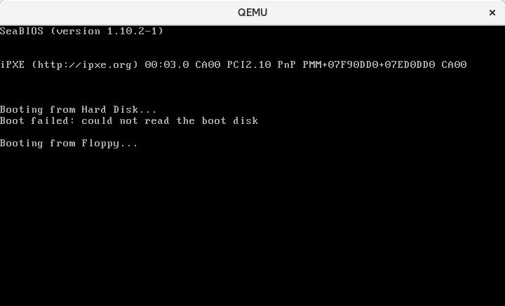
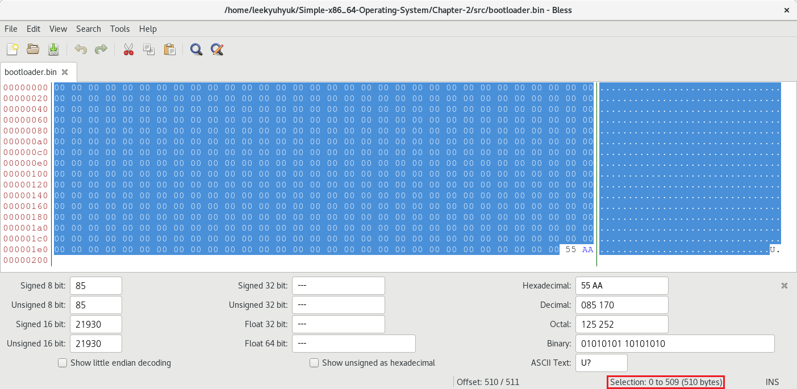

## Chapter 2: GNU Assembler를 통해 나만의 부트로더 코드(16비트 CPU코드)를 만들어보자!

### Introduction to Microprocessor

Microprocessor 프로그래밍을 배우기 위해서는 레지스터를 사용하는 법을 배워야 합니다.

#### What are registers?

레지스터에는 4개의 종류가 있습니다.

- 범용 레지스터 (General purpose registers)
- 세그먼트 레지스터 (Segment registers)
- 스택 레지스터 (Stack registers)
- 인덱스 레지스터 (Index registers)

**범용 레지스터 (General purpose registers)** : 프로그램이 실행되는 동안 필요한 임시 데이터를 저장하는 데 사용됩니다.

- `AX` - Accumulator Register
- `BX` - Base Address Register
- `CX` - Count Register
- `DX` - Data Register

**세그먼트 레지스터 (Segment registers)** : Microprocessor에 메모리 주소를 나타내려면 Segment(일반적으로 메모리 블록의 시작 부분)와 Offset(Segment에 대한 상대 주소)을 알아야 합니다.

예를 들어, 시작 주소가 `0x7C00`이고 Memory Block에 값이 `X`인 Byte가 10번째 위치에 있다고 가정한다면, Segment를 `0x7C00`으로, Offset을 `10`으로 표기합니다. 절대 주소는 `0x7C00 + 10`입니다.

- `CS` - Code Segment
- `SS` - Stack Segment
- `DS` - Data Segment
- `ES` - Extended Segment

하지만, 이런 레지스터들은 한계가 있습니다. 위의 레지스터에 직접 주소를 할당할 수 없기 때문에 범용 레지스터 (General purpose registers)에 주소를 복사한 다음, 해당 레지스터의 주소를 세그먼트 레지스터 (Segment registers)에 복사합니다.

위의 `X`Byte를 찾기 위해서는 아래와 같은 방법을 사용합니다.  
```
movw $0x07c0, %ax        # AX에 0x07C0을 설정합니다.
movw %ax    , %ds        # DS에 AX값을 설정합니다. (DS = 0x07C0)
movw (0x0A) , %ax        # AX에 0x7C00 + 0x0A을 설정합니다.
```

**스택 레지스터 (Stack registers)** :

- `BP` - Base Pointer (현재 스택에 가장 바닥을 가리키는 포인터)
- `SP` - Stack Pointer (현재 스택에 가장 위에 들어있는 데이터를 가리키고 있는 포인터)

**인덱스 레지스터 (Index registers)** :

- `SI` - 문자열에 관련된 작업을 할 때 원본 문자열의 Index로 사용
- `DI` - 문자열에 관련된 작업을 할 때 목적지 문자열의 Index로 사용
- `AX` - 산술 연산을 수행할 때 누산기로 사용
- `BX` - Data의 주소를 지정할 때 Data Pointer로 사용
- `CX` - Loop(반복문) 또는 문자열의 Count로 사용
- `DX` - I/O 주소를 지정할 때 사용 / 산술 연산시 보조 레지스터로도 사용된다.

### How do I generate code for real mode through an assembler?

CPU가 Real Mode(16Bit)에서 시작되면 장치에서 부팅하는 동안 BIOS가 제공하는 내장 기능을 활용하여 많은 것들을 할 수 있습니다.  
BIOS의 기능을 활용하여 나만의 부트로더 코드를 작성한 다음, 장치의 부트 섹터로 Dump 한 뒤 부팅하는 것입니다.  
GNU Assembler를 통해 나만의 부트로더 코드(16비트 CPU코드)를 만들어봅시다.

`bootloader.S`를 아래와 같이 작성해줍니다.  
```
.org 0x00              # Code의 시작 주소를 0x00으로 설정
.code16                # 16비트 코드로 설정

.text                  # Text Segment를 정의
    .globl _start;

_start:
    . = _start + 510   # 현재 위치(0x00)에서 510번 주소로 mov
                       # 현재 위치(0x00)에서 510번 주소까지 0x00으로 채워진다.
    .byte 0x55         # Boot Signature 추가
    .byte 0xaa         # 0x55 0xAA는 부트로더임을 알리는 값입니다.
```

- `.text` : `.text` Section에는 프로그램을 구성하는 실제 기계 명령어가 들어 있습니다.
- `.globl _start` : `.global <symbol>`은 Symbol을 Linker에게 보이게 합니다.
- `_start` : Linker가 기본으로 진입하는 곳입니다.
- ` = _start + 510` : 처음부터 510번째 바이트까지 이동합니다.
- `.byte 0x55` : Boot Signature의 일부로 식별되는 첫 번째 바이트입니다. (511번째 바이트에 기록됩니다)
- `.byte 0xAA` : Boot Signature의 일부로 식별되는 두 번째 바이트입니다. (512번째 바이트에 기록됩니다

> The (legacy) BIOS checks bootable devices for a boot signature, a so called magic number. The boot signature is in a boot sector (sector number 0) and it contains the byte sequence 0x55, 0xAA at byte offsets 510 and 511 respectively. When the BIOS finds such a boot sector, it is loaded into memory at 0x0000:0x7c00 (segment 0, address 0x7c00). (However, some BIOS' load to 0x7c0:0x0000 (segment 0x07c0, offset 0), which resolves to the same physical address, but can be surprising. A good practice is to enforce CS:IP at the very start of your boot sector.)
[OSDev.org Wiki - Boot Sequence](https://wiki.osdev.org/Boot_Sequence)

### How to compile an assembly program?

`bootloader.S`를 모두 작성했다면, 저장하고 아래의 명령을 터미널에 입력합니다.

```
$ x86_64-linux-gnu-as -c bootloader.S -o bootloader.o
$ x86_64-linux-gnu-ld -Ttext 0x7c00 --oformat=binary bootloader.o -o bootloader.bin
```

- `x86_64-linux-gnu-as -c bootloader.S -o bootloader.o` : Assembly로 작성된 `bootloader.S` 코드를 기계코드로 변환하기 전에 Assembler에 의해 생성된 Object Code로 변환합니다.
- `-Ttext 0x7c00` : Linker에게 `text`(Code Segment)의 주소가 `0x7C00`에 로드되도록 설정합니다.
- `--oformat=binary` : Output 파일이 Plain Binary Image(No Startup code, No Relocations, ... )가 되도록 Linker에게 알립니다.

### How to copy the executable code to a bootable device and then test it?

`qemu-system-x86_64 -M pc -fda bootloader.bin` 명령을 사용하여 가상머신에서 테스트를 할 수 있습니다.  
아래 화면처럼 "`Booting from Floppy...`"에서 멈춰있다면 부팅에 성공한 것입니다.  
부팅한 뒤 무엇을 할지 아직 프로그래밍하지 않아 저 상태에서 멈춰있는 것입니다.  


HexEditor로 `bootloader.bin`을 보면, 510Byte는 `00`으로 기록되어있고 511Byte에 `55`, 512Byte에는 `AA`로 기록된 걸 확인할 수 있습니다.

