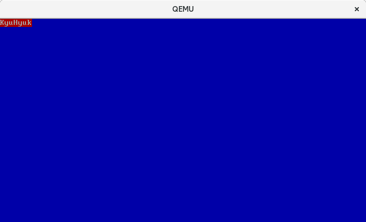

## Chapter 3: VGA Text Buffer를 사용하여 화면 제어를 해보자!

[Chapter 2](https://github.com/LeeKyuHyuk/Simple-x86_64-Operating-System/blob/master/Chapter-2/README.md)에서는 간단한 부트로더를 만들어 보았습니다.  
이번 시간에는 Text Buffer를 사용하여 화면에 글자를 띄워보도록 하겠습니다.


### VGA-compatible text mode


PC가 부팅하면 가로 80문자, 세로 25문자를 화면에 띄울 수 있습니다.  
화면에 글자를 띄우기 위해 사용하는 Video Memory Address는 `0xB800`부터 시작합니다.  
위의 'VGA-compatible text mode'를 설명하는 그림을 보면 1문자에 글자의 속성을 정하는 Attribute 1바이트와 Character 1바이트를 사용하는 것을 볼 수 있습니다.  
총 메모리 크기는 `80(가로) * 25(세로) * 2 = 4,000바이트`입니다.

#### Text Attribute Value

Number | Color      | Number + Bright Bit | Bright Color
------ | ---------- | ------------------- | -------------
0x0    | Black      | 0x8                 | Dark Gray
0x1    | Blue       | 0x9                 | Light Blue
0x2    | Green      | 0xa                 | Light Green
0x3    | Cyan       | 0xb                 | Light Cyan
0x4    | Red        | 0xc                 | Light Red
0x5    | Magenta    | 0xd                 | Pink
0x6    | Brown      | 0xe                 | Yellow
0x7    | Light Gray | 0xf                 | White

Assemble 코드 작성 방법도 생각보다 어렵지 않습니다.  
[Chapter 2](https://github.com/LeeKyuHyuk/Simple-x86_64-Operating-System/blob/master/Chapter-2/README.md)에서 배웠던 Segment Register와 Offset 개념을 사용하면 됩니다.

```
.org 0x00                             # Code의 시작 주소를 0x00으로 설정합니다.
.code16                               # 16비트 코드로 설정합니다.

.text                                 # Text Segment를 정의합니다.
    .globl _start;

_start:
    mov $0xB800, %AX                  # AX에 0xB800을 설정합니다.
    movw %AX, %DS                     # DS에 AX값을 설정합니다. (DS = 0xB800)

    movb $'K', %DS:0x00               # 0xB800 + 0x0000에 'K' Byte를 저장합니다.
    movb $0x47, %DS:0x01              # 0xB800 + 0x0001에 '0x47' Byte를 저장합니다.
    movb $'H', %DS:0x02               # 0xB800 + 0x0002에 'H' Byte를 저장합니다.
    movb $0x17, %DS:0x03              # 0xB800 + 0x0003에 '0x17' Byte를 저장합니다.

    . = _start + 510                  # 현재 위치에서 510번 주소로 이동합니다.
                                      # 현재 위치에서 510번 주소까지 0x00으로 채워진다.
    .byte 0x55                        # Boot Signature를 추가합니다.
    .byte 0xAA                        # 0x55 0xAA는 부트로더임을 알리는 값입니다.

```

실행하면 아래와 같이 왼쪽 상단에 빨간색 배경의 'K'와 파란색 배경의 'H'가 출력되는 것을 확인할 수 있습니다.  


우리가 원하는 것은 아무것도 없는 검정 화면에 글자를 띄우는 건데 위의 사진을 보면 다른 글자 위에 겹쳐서 출력되고 있습니다.  
이 문제를 해결하기 위해서는 화면을 모두 지워주는 기능을 구현해야 합니다.  
아래와 같이 반복문을 사용하면 간단하게 구현할 수 있습니다.

```
.org 0x00                      # Code의 시작 주소를 0x00으로 설정합니다.
.code16                        # 16비트 코드로 설정합니다.

.text                          # Text Segment를 정의합니다.
    .globl _start;

_start:
    mov $0x7C00, %AX           # AX에 0x7C00(부트로더의 시작 주소)를 설정합니다.
    movw %AX, %DS              # DS에 AX값을 설정합니다. (DS = 0x7C00)
    mov $0xB800, %AX           # AX에 0xB800(비디오 메모리의 시작 주소)를 설정합니다.
    movw %AX, %ES              # ES에 AX값을 설정합니다. (ES = 0xB800)
    mov 0, %SI                 # SI 레지스터를 초기화합니다.

.SCREENCLEARLOOP:              # 화면을 지우는 반복문
    movb $0x00, %ES:(%SI)      # 비디오 메모리의 문자에 위치하는 주소에 0을 복사하여 문자를 삭제
    movb $0x1F, %ES:1(%SI)     # 속성값에 파란 바탕에 하얀 글씨 속성을 복사
    add $2, %SI                # 문자와 속성을 설정했으므로 다음 위치(2바이트뒤)로 이동
    cmp $(80 * 25 * 2), %SI    # 화면의 전체 크기(80*25*2)와 SI의 값을 비교
    jl .SCREENCLEARLOOP        # SI 레지스터가 80*25*2의 값보다 작다면 아직 지우지 못한 영역이 있으므로,
                               # .SCREENCLEARLOOP 레이블로 이동

. = _start + 510               # 현재 위치(0x00)에서 510번 주소로 이동
                               # 현재 위치(0x00)에서 510번 주소까지 0x00으로 채워진다.
.byte 0x55	 	                 # Boot Signature 추가
.byte 0xaa                     # 0x55 0xAA는 부트로더임을 알리는 값입니다.
```

코드를 실행하면 아래와 같이 파란 바탕으로 화면이 모두 지워진 것을 확인할 수 있습니다.



이제 한번 우리가 원하는 문구를 띄워볼까요?
