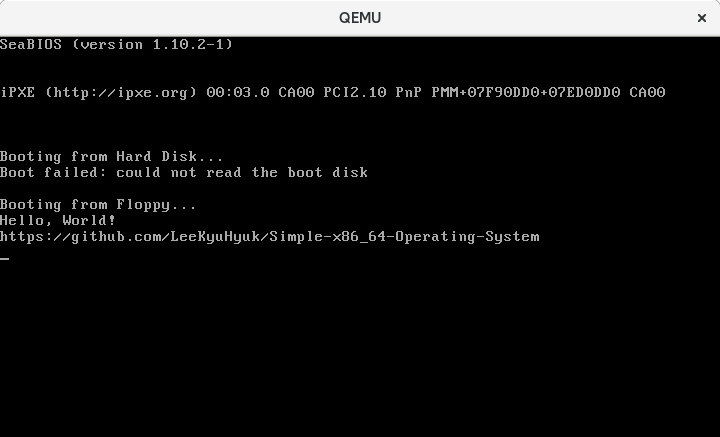

## Chapter 4: INT (x86 instruction)

> INT는 x86 중앙 처리 장치를 위한 어셈블리어로서, 인터럽트를 발생시키는 역할을 한다. 이것은 바이트 값으로 구성된 인터럽트 번호를 가진다.  
[Wikipedia - INT (x86 명령어)](https://ko.wikipedia.org/wiki/INT_%28x86_%EB%AA%85%EB%A0%B9%EC%96%B4%29)

인터럽트는 INT x86 Assembly 명령을 이용하여 호출할 수 있습니다.  
예를 들면, BIOS 인터럽트 `0x10`(TTY 모드에서 문자열 쓰기)를 이용하여 문자열을 화면에 출력하려면 다음의 x86 Assembly 코드를 실행하면 됩니다.

```
#print letter 'K' onto the screen
movb $'K' , %AL                    # 출력할 문자
movb $0x0E, %AH                    # 출력할 BIOS Service Code
int  $0x10                         # 인터럽트 0x10 발생
```

### BIOS Interrupt Table

BIOS Interrupt의 종류는 다양합니다. 우리는 이 중에 '비디오 서비스(`0x10h`)'를 사용할 것입니다.


BIOS Interrupt를 사용하면 아래와 같은 코드로 화면에 글씨를 출력할 수 있습니다.

```
.org 0x00                          # Code의 시작 주소를 0x00으로 설정합니다.
.code16                            # 16비트 코드로 설정합니다.

.text                              # Text Segment를 정의합니다.
    .globl _start;

_start:
    #print letter 'K' onto the screen
    movb $'K' , %AL                # 출력할 문자
    movb $0x0E, %AH                # BIOS Service Code (Write Character in TTY Mode)
    int  $0x10                     # 인터럽트 0x10 발생 (Video Service)

    #print letter 'y' onto the screen
    movb $'y' , %AL
    movb $0x0E, %AH
    int  $0x10

    #print letter 'u' onto the screen
    movb $'u' , %AL
    movb $0x0E, %AH
    int  $0x10

    #print letter 'H' onto the screen
    movb $'H' , %AL
    movb $0x0E, %AH
    int  $0x10

    #print letter 'y' onto the screen
    movb $'y' , %AL
    movb $0x0E, %AH
    int  $0x10

    #print letter 'u' onto the screen
    movb $'u' , %AL
    movb $0x0E, %AH
    int  $0x10

    #print letter 'k' onto the screen
    movb $'k' , %AL
    movb $0x0E, %AH
    int  $0x10

    . = _start + 510                # 현재 위치에서 510번 주소로 이동합니다.
                                    # 현재 위치에서 510번 주소까지 0x00으로 채워진다.
    .byte 0x55                      # Boot Signature를 추가합니다.
    .byte 0xAA                      # 0x55 0xAA는 부트로더임을 알리는 값입니다.
```


하지만 위와 같이 코드를 작성할 경우 50글자가 되는 문자를 입력하고 싶을 때는 200줄이 되는 코드를 작성해야 하는 문제가 생기게 됩니다.  
함수와 매크로를 사용하면 간편하게 해결할 수 있습니다.

```
.org 0x00                          # Code의 시작 주소를 0x00으로 설정합니다.
.code16                            # 16비트 코드로 설정합니다.

.text                              # Text Segment를 정의합니다.
    .globl _start;

_start:
    jmp _boot                      # _boot 레이블로 이동합니다.

    # helloWorld, url에 문자열을 정의합니다.
    helloWorld: .asciz "Hello, World!\n\r"
    url: .asciz "https://github.com/LeeKyuHyuk/Simple-x86_64-Operating-System\n\r"

    # <Macro Start> print(str) : String을 출력하는 매크로
    .macro print str
        leaw  \str, %si            # str(argument)의 주소를 SI레지스터에 넣습니다.
        call .putchar              # putchar 호출합니다.
    .endm
    # <Macro End> print(str)

    # <Function Start> putchar : Character를 출력합니다.
    .putchar:
        lodsb                      # AX의 하위 1바이트(AL) 레지스터에
                                   # DS 세그먼트의 오프셋 SI 의 값을 저장합니다.
                                   # AL = DS:SI와 같습니다.
                                   # 여기서 SI의 값은 print 매크로에서 저장한 str(argument)의 주소 입니다.
        orb  %AL, %AL              # % AL과 AL를 OR 연산 합니다.
        jz   .putchar_end          # orb  %al, %al의 결과가 0일 경우 .putchar_end로 이동합니다.
        movb $0x0E, %AH            # BIOS Service Code (Write Character in TTY Mode)
        int  $0x10                 # 인터럽트 0x10 발생 (Video Service)
        jmp  .putchar              # .putchar_end로 이동합니다. (Loop)
    # <Function End> putchar

    # <Function Start> putchar_end : putchar에서 Character를 모두 출력했을때 진입되는 Function 입니다.
    .putchar_end:
        ret                        # 처음 함수나 매크로를 호출했던곳으로 이동합니다.
    # <Function End> putchar_end

_boot:
    # _start에 있는 print 매크로를 실행합니다. argument로 helloWorld와 url를 넣습니다.
    print helloWorld
    print url

. = _start + 510                   # 현재 위치에서 510번 주소로 이동합니다.
                                   # 현재 위치에서 510번 주소까지 0x00으로 채워진다.
.byte 0x55                         # Boot Signature를 추가합니다.
.byte 0xAA                         # 0x55 0xAA는 부트로더임을 알리는 값입니다.
```


