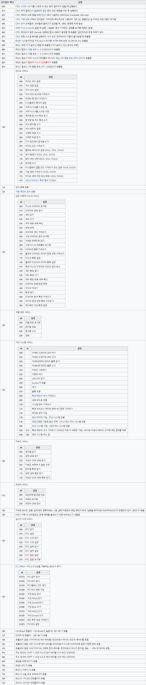
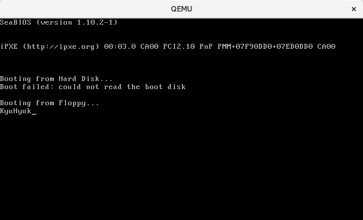

## Chapter 4: INT (x86 instruction)

> INT는 x86 중앙 처리 장치를 위한 어셈블리어로서, 인터럽트를 발생시키는 역할을 한다. 이것은 바이트 값으로 구성된 인터럽트 번호를 가진다.  
[Wikipedia - INT (x86 명령어)](https://ko.wikipedia.org/wiki/INT_%28x86_%EB%AA%85%EB%A0%B9%EC%96%B4%29)

인터럽트는 INT x86 Assembly 명령을 이용하여 호출할 수 있습니다.  
예를 들면, BIOS 인터럽트 `0x10`(TTY 모드에서 문자열 쓰기)를 이용하여 문자열을 화면에 출력하려면 다음의 x86 Assembly 코드를 실행하면 됩니다.

```
#print letter 'K' onto the screen
movb $'K' , %AL    # 출력할 문자
movb $0x0E, %AH    # 출력할 BIOS Service Code
int  $0x10         # 인터럽트 0x10 발생
```

### BIOS Interrupt Table



BIOS Interrupt를 사용하면 아래와 같은 코드로 화면에 글씨를 출력할 수 있습니다.

```
.org 0x00			# Code의 시작 주소를 0x00으로 설정합니다.
.code16				# 16비트 코드로 설정합니다.

.text				# Text Segment를 정의합니다.
	.globl _start;

_start:
	#print letter 'K' onto the screen
	movb $'K' , %AL		# 출력할 문자
	movb $0x0E, %AH		# BIOS Service Code (Write Character in TTY Mode)
	int  $0x10		# 인터럽트 0x10 발생 (Video Service)

	#print letter 'y' onto the screen
	movb $'y' , %AL
	movb $0x0E, %AH
	int  $0x10

	#print letter 'u' onto the screen
	movb $'u' , %AL
	movb $0x0E, %AH
	int  $0x10

	#print letter 'H' onto the screen
	movb $'H' , %AL
	movb $0x0E, %AH
	int  $0x10

	#print letter 'y' onto the screen
	movb $'y' , %AL
	movb $0x0E, %AH
	int  $0x10

	#print letter 'u' onto the screen
	movb $'u' , %AL
	movb $0x0E, %AH
	int  $0x10

	#print letter 'k' onto the screen
	movb $'k' , %AL
	movb $0x0E, %AH
	int  $0x10

	. = _start + 510	# 현재 위치에서 510번 주소로 이동합니다.
				# 현재 위치에서 510번 주소까지 0x00으로 채워진다.
	.byte 0x55		# Boot Signature를 추가합니다.
	.byte 0xAA		# 0x55 0xAA는 부트로더임을 알리는 값입니다.
```



하지만 위와 같이 코드를 작성할 경우 50글자가 되는 문자를 입력하고 싶을 때는 200줄이 되는 코드를 작성해야 하는 문제가 생기게 됩니다.
